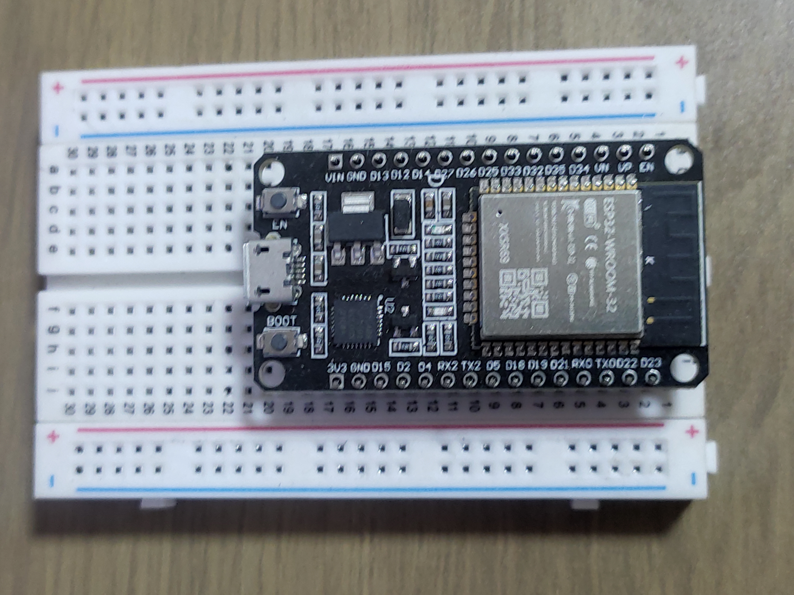
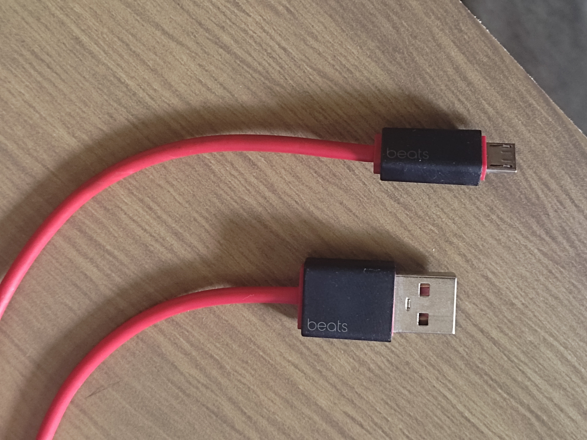

🌐 Projeto - Servidor Local com ESP32 — Fundamentos de Infraestrutura

📘 Descrição
Este projeto demonstra como transformar um ESP32 em um servidor web local, capaz de hospedar uma página HTML acessível via Wi-Fi.
A atividade foi desenvolvida como parte da disciplina de Fundamentos de Infraestrutura, utilizando a IDE Arduino na versão 2.3.6.

🎯 Objetivos
Configurar o ESP32 como servidor HTTP.

Servir conteúdo HTML diretamente do microcontrolador.

Utilizar SPIFFS para armazenar e servir arquivos estáticos.

Compreender a arquitetura cliente-servidor em sistemas embarcados.

🧰 Requisitos
ESP32 DevKit

Cabo USB Micro (use de preferência um original)

Arduino IDE 2.3.6

Linguagem: C++ (Arduino Framework)

Bibliotecas:

WiFi.h — conexão com rede Wi-Fi

WebServer.h — servidor HTTP

SPIFFS.h — sistema de arquivos interno

🗂️ Organização de Arquivos
index.html — página principal (embutida no código)

/assets/horta.jpg — imagem servida via SPIFFS

/assets/jardinagem.jpg — imagem servida via SPIFFS

/assets/apae.png — imagem servida via SPIFFS

Para carregar os arquivos no SPIFFS, utilize o plugin "ESP32 Sketch Data Upload" ou o gerenciador de arquivos do PlatformIO.

📡 Acesso ao Servidor
Após o upload do código e conexão do ESP32 à rede, o IP local será exibido no monitor serial. Basta digitar esse IP no navegador para acessar a página hospedada.

🧠 Aprendizados
Como configurar um servidor HTTP embarcado.

Como servir arquivos estáticos com SPIFFS.

Como estruturar rotas e responder requisições HTTP.

Como integrar HTML, CSS e JavaScript em sistemas embarcados.
